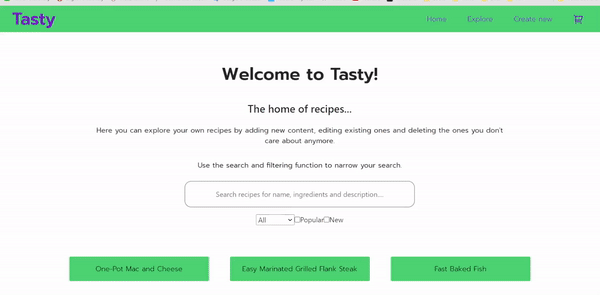

# Tasty

Tasty is the team project of "INFT2002 web development" in NTNU in the autumn semester 2022. Tasty
is a website that users can create/edit/delete/search for their own recipes and provides external
recipes using API.

## Video demonstration of the app (URL-link)

- 

https://youtu.be/X1sPoUpWjuo

## Link to the GitLab project online

https://gitlab.stud.idi.ntnu.no/fnolsson/tasty-v2

## Installing and running Tasty App

### Includes

- Automatic refresh on save in development
- External API communication powered by Spoonacular
- SQL request to NTNU database (Need to be connected via VPN to NTNU for it to work)

#### VPN

If you are not connected to NTNU at campus, then press the link for a guide on how to set up a VPN
connection to NTNU here https://i.ntnu.no/wiki/-/wiki/English/Install+VPN.

## Setup database connections

You need to create two configuration files that will contain the database connection details. These
files should not be uploaded to your git repository, and they have therefore been added to
`.gitignore`. The connection details may vary, but example content of the two configuration files
are as follows:

`server/config.ts`:

```ts
process.env.MYSQL_HOST = 'mysql.stud.ntnu.no';
process.env.MYSQL_USER = 'username_todo';
process.env.MYSQL_PASSWORD = 'username_todo';
process.env.MYSQL_DATABASE = 'sondest_gruppe5_dev';
process.env.REACT_API_KEY = 'Top-secret-key-here';
```

If you do not have an API key to spoonacular, press the link and create an account here
https://spoonacular.com/food-api/console#. After confirming you account with your email and logging
in, press `profile`, then press `Show / Hide API Key`, and then copy paste the API key into
`Top-secret-key-here` inside the `server/config.ts` file.

If you rather want to use an existing api key, you can look at "User credentials" further down this
README file

`server/test/config.ts`:

```ts
process.env.MYSQL_HOST = 'mysql.stud.ntnu.no';
process.env.MYSQL_USER = 'username_todo';
process.env.MYSQL_PASSWORD = 'username_todo';
process.env.MYSQL_DATABASE = 'sondest_gruppe5_test';
process.env.REACT_API_KEY = 'test_key';
```

These environment variables will be used in the `server/src/mysql-pool.ts` file.

## Start server

Install dependencies and start server:

```sh
cd server
npm install
npm start
```

### Run server tests:

```sh
npm test
```

## Bundle client files to be served through server

Install dependencies and bundle client files:

```sh
cd client
npm install
npm start
```

### Run client tests:

```sh
npm test
```

## Set up SQL-database to communicate with app or use the existing account below

### User credentials

#### Only for exam purposes to gain access to example recipes already in NTNU-SQL database

```ts
process.env.MYSQL_USER = 'sondest_INFT2002';
process.env.MYSQL_PASSWORD = 'adminpassord';
process.env.REACT_API_KEY = '7859d90a7de34b15afed1a781d9e38c9';
```

### INFT2002 Webutvikling Prosjektoppgave SQL-commands

```sql
/* Delete tables */
DROP TABLE If EXISTS recipes;
DROP TABLE If EXISTS ingredients;
DROP TABLE If EXISTS units;
DROP TABLE If EXISTS relations;

/* Create tables */
CREATE TABLE IF NOT EXISTS recipes (id INT NOT NULL AUTO_INCREMENT PRIMARY KEY, name VARCHAR(255) NOT NULL, meal_type VARCHAR(255), new BOOLEAN, popular BOOLEAN, description TEXT);

CREATE TABLE IF NOT EXISTS ingredients (id INT NOT NULL AUTO_INCREMENT PRIMARY KEY, ingredient VARCHAR(255));

CREATE TABLE IF NOT EXISTS units (id INT NOT NULL AUTO_INCREMENT PRIMARY KEY, unit VARCHAR(255));

CREATE TABLE IF NOT EXISTS relations (recipes_id INT, ingredients_id INT, unit_id INT, amount FLOAT);


/* Insert sample recipes */
INSERT INTO `recipes`(`name`, `meal_type`, `new`, `popular`, `description`) VALUES ('One-Pot Mac and Cheese','Dinner',TRUE,FALSE,'Who likes cleaning up after making mac and cheese? Not this girl. This one-pot mac and cheese is a family favorite, and my 3-year-old is thrilled to see it coming to the dinner table. We love to add sliced smoked sausage to this creamy mac recipe!');

INSERT INTO `recipes`(`name`, `meal_type`, `new`, `popular`, `description`) VALUES ('Easy Marinated Grilled Flank Steak','Dinner',FALSE,FALSE,'Friends shared this three-ingredient marinade years ago, and it’s been a favorite since. Serve the steak with salad and grilled potatoes for a quick meal.');

INSERT INTO `recipes`(`name`, `meal_type`, `new`, `popular`, `description`) VALUES ('Fast Baked Fish','Dinner',TRUE,TRUE,'We always have a good supply of fresh fish, so I make fish recipes often. This recipe is my favorite because it is moist, tender and flavorful.');

INSERT INTO `recipes`(`name`, `meal_type`, `new`, `popular`, `description`) VALUES ('Ravioli Lasagna','Lunch',TRUE,FALSE,'When you taste this casserole, you''ll think it came from a complicated, from-scratch recipe. Really, though, it starts with frozen ravioli and has only three other ingredients.');
INSERT INTO `recipes`(`name`, `meal_type`, `new`, `popular`, `description`) VALUES ('Buttery Parmesan Chicken','Lunch',FALSE,FALSE,'A rich, cheesy breading locks in this chicken''s natural juices, making it moist and tempting every time. Because it can be made in advance, I rely on it often during the week and when entertaining.');

INSERT INTO `recipes`(`name`, `meal_type`, `new`, `popular`, `description`) VALUES ('Prosciutto and Cheese Puff Pastry Pinwheels','Lunch','1','0','Creamy Italian herb spread, prosciutto, and parmesan cheese are layered in a crisp puff pastry pinwheel for an easy party appetizer.');

INSERT INTO `recipes`(`name`, `meal_type`, `new`, `popular`, `description`) VALUES ('Pistachio Cardamom Tres Leches Cake','Dessert','1','0','Tres leches cake meets Indian flavors in this twist on the classic. Soak a pistachio-enriched cake in sweet, spiced milk and spread with whipped cream topping.');

INSERT INTO `recipes`(`name`, `meal_type`, `new`, `popular`, `description`) VALUES ('Instant Pot Mushroom Risotto','Breakfast','1','0','Easy weeknight mushroom risotto that’s special enough for occasions, too! The Instant Pot makes it fast, and fail-safe. Plus we have a hack that lets you time your dinner perfectly!');

INSERT INTO `recipes`(`name`, `meal_type`, `new`, `popular`, `description`) VALUES ('Roasted Brussels Sprouts','Snack','1','1','Even the most adamant sprouts haters will love these roasted Brussels sprouts with garlic, olive oil, lemon juice, and Parmesan cheese. So crispy and delicious!');


/* Insert sample ingredients */
INSERT INTO `ingredients`(`ingredient`) VALUES ('whole milk');
INSERT INTO `ingredients`(`ingredient`) VALUES ('water');
INSERT INTO `ingredients`(`ingredient`) VALUES ('elbow macaroni (16 ounces)');
INSERT INTO `ingredients`(`ingredient`) VALUES ('velveeta, cubed');
INSERT INTO `ingredients`(`ingredient`) VALUES ('shredded sharp cheddar cheese');
INSERT INTO `ingredients`(`ingredient`) VALUES ('salt');
INSERT INTO `ingredients`(`ingredient`) VALUES ('coarsely ground pepper');

INSERT INTO `ingredients`(`ingredient`) VALUES ('barbecue sauce');
INSERT INTO `ingredients`(`ingredient`) VALUES ('burgundy wine or beef broth');
INSERT INTO `ingredients`(`ingredient`) VALUES ('lemon juice');
INSERT INTO `ingredients`(`ingredient`) VALUES ('beef flank steak (2 pounds)');

INSERT INTO `ingredients`(`ingredient`) VALUES ('fish fillets (1/4 pounds)');
INSERT INTO `ingredients`(`ingredient`) VALUES ('seasoned salt');
INSERT INTO `ingredients`(`ingredient`) VALUES ('paprika, optional');
INSERT INTO `ingredients`(`ingredient`) VALUES ('butter, melted');
INSERT INTO `ingredients`(`ingredient`) VALUES ('pepper to taste');

INSERT INTO `ingredients`(`ingredient`) VALUES ('ground beef');
INSERT INTO `ingredients`(`ingredient`) VALUES ('spaghetti sauce');
INSERT INTO `ingredients`(`ingredient`) VALUES ('frozen sausage or cheese ravioli (25 ounces)');
INSERT INTO `ingredients`(`ingredient`) VALUES ('shredded part-skim mozzarella cheese');
INSERT INTO `ingredients`(`ingredient`) VALUES ('minced fresh basil, optional');

INSERT INTO `ingredients`(`ingredient`) VALUES ('grated parmesan cheese');
INSERT INTO `ingredients`(`ingredient`) VALUES ('soft bread crumbs');
INSERT INTO `ingredients`(`ingredient`) VALUES ('boneless skinless chicken breast halves (6 ounces each)');
INSERT INTO `ingredients`(`ingredient`) VALUES ('dijon, yellow or country-style mustard');

INSERT INTO `ingredients`(`ingredient`) VALUES ('apple');
INSERT INTO `ingredients`(`ingredient`) VALUES ('sugar');
INSERT INTO `ingredients`(`ingredient`) VALUES ('mixed nuts');
INSERT INTO `ingredients`(`ingredient`) VALUES ('mayoonnaise');
INSERT INTO `ingredients`(`ingredient`) VALUES ('basil leaves');
INSERT INTO `ingredients`(`ingredient`) VALUES ('oregano');
INSERT INTO `ingredients`(`ingredient`) VALUES ('egg');
INSERT INTO `ingredients`(`ingredient`) VALUES ('pistachios');
INSERT INTO `ingredients`(`ingredient`) VALUES ('flour');
INSERT INTO `ingredients`(`ingredient`) VALUES ('vanilla extract');
INSERT INTO `ingredients`(`ingredient`) VALUES ('almonds');
INSERT INTO `ingredients`(`ingredient`) VALUES ('extra virgin olive oil');
INSERT INTO `ingredients`(`ingredient`) VALUES ('mushroom');
INSERT INTO `ingredients`(`ingredient`) VALUES ('garlic cloves');
INSERT INTO `ingredients`(`ingredient`) VALUES ('white wine');
INSERT INTO `ingredients`(`ingredient`) VALUES ('soy sauce');
INSERT INTO `ingredients`(`ingredient`) VALUES ('chicken stock');
INSERT INTO `ingredients`(`ingredient`) VALUES ('brussels sprouts');
INSERT INTO `ingredients`(`ingredient`) VALUES ('minced garlic cloves');
INSERT INTO `ingredients`(`ingredient`) VALUES ('kosher salt');

/* Insert sample units */
INSERT INTO `units`(`unit`) VALUES ('');
INSERT INTO `units`(`unit`) VALUES ('cup');
INSERT INTO `units`(`unit`) VALUES ('package');
INSERT INTO `units`(`unit`) VALUES ('ounce');
INSERT INTO `units`(`unit`) VALUES ('teaspoon');
INSERT INTO `units`(`unit`) VALUES ('tablespoon');
INSERT INTO `units`(`unit`) VALUES ('pound');
INSERT INTO `units`(`unit`) VALUES ('jar');

/* Insert sample relations between recipes, ingredients, units, and amounts */
INSERT INTO `relations`(`recipes_id`, `ingredients_id`, `unit_id`, `amount`) VALUES (1,1,2,1.5);
INSERT INTO `relations`(`recipes_id`, `ingredients_id`, `unit_id`, `amount`) VALUES (1,2,2,3);
INSERT INTO `relations`(`recipes_id`, `ingredients_id`, `unit_id`, `amount`) VALUES (1,3,3,1);
INSERT INTO `relations`(`recipes_id`, `ingredients_id`, `unit_id`, `amount`) VALUES (1,4,4,4);
INSERT INTO `relations`(`recipes_id`, `ingredients_id`, `unit_id`, `amount`) VALUES (1,5,2,2);
INSERT INTO `relations`(`recipes_id`, `ingredients_id`, `unit_id`, `amount`) VALUES (1,6,5,0.5);
INSERT INTO `relations`(`recipes_id`, `ingredients_id`, `unit_id`, `amount`) VALUES (1,7,5,0.5);

INSERT INTO `relations`(`recipes_id`, `ingredients_id`, `unit_id`, `amount`) VALUES (2,8,2,1);
INSERT INTO `relations`(`recipes_id`, `ingredients_id`, `unit_id`, `amount`) VALUES (2,9,2,0.5);
INSERT INTO `relations`(`recipes_id`, `ingredients_id`, `unit_id`, `amount`) VALUES (2,10,2,0.25);
INSERT INTO `relations`(`recipes_id`, `ingredients_id`, `unit_id`, `amount`) VALUES (2,11,1,1);

INSERT INTO `relations`(`recipes_id`, `ingredients_id`, `unit_id`, `amount`) VALUES (3,12,1,1);
INSERT INTO `relations`(`recipes_id`, `ingredients_id`, `unit_id`, `amount`) VALUES (3,13,5,1);
INSERT INTO `relations`(`recipes_id`, `ingredients_id`, `unit_id`) VALUES (3,14,1);
INSERT INTO `relations`(`recipes_id`, `ingredients_id`, `unit_id`) VALUES (3,15,1);
INSERT INTO `relations`(`recipes_id`, `ingredients_id`, `unit_id`, `amount`) VALUES (3,16,6,3);

INSERT INTO `relations`(`recipes_id`, `ingredients_id`, `unit_id`, `amount`) VALUES (4,17,1,1);
INSERT INTO `relations`(`recipes_id`, `ingredients_id`, `unit_id`, `amount`) VALUES (4,18,8,1);
INSERT INTO `relations`(`recipes_id`, `ingredients_id`, `unit_id`, `amount`) VALUES (4,19,3,1);
INSERT INTO `relations`(`recipes_id`, `ingredients_id`, `unit_id`, `amount`) VALUES (4,20,2,0.5);
INSERT INTO `relations`(`recipes_id`, `ingredients_id`, `unit_id`) VALUES (4,21,1);

INSERT INTO `relations`(`recipes_id`, `ingredients_id`, `unit_id`, `amount`) VALUES (5,22,2,1);
INSERT INTO `relations`(`recipes_id`, `ingredients_id`, `unit_id`, `amount`) VALUES (5,23,2,2);
INSERT INTO `relations`(`recipes_id`, `ingredients_id`, `unit_id`, `amount`) VALUES (5,15,2,0.5);
INSERT INTO `relations`(`recipes_id`, `ingredients_id`, `unit_id`, `amount`) VALUES (5,24,1,6);
INSERT INTO `relations`(`recipes_id`, `ingredients_id`, `unit_id`, `amount`) VALUES (5,25,2,0.5);

INSERT INTO `relations`(`recipes_id`, `ingredients_id`, `unit_id`, `amount`) VALUES (6,25,6,2);
INSERT INTO `relations`(`recipes_id`, `ingredients_id`, `unit_id`, `amount`) VALUES (6,30,6,2);
INSERT INTO `relations`(`recipes_id`, `ingredients_id`, `unit_id`, `amount`) VALUES (6,31,2,1);
INSERT INTO `relations`(`recipes_id`, `ingredients_id`, `unit_id`, `amount`) VALUES (6,32,2,1);
INSERT INTO `relations`(`recipes_id`, `ingredients_id`, `unit_id`, `amount`) VALUES (6,33,1,1);
INSERT INTO `relations`(`recipes_id`, `ingredients_id`, `unit_id`, `amount`) VALUES (6,2,6,1);

INSERT INTO `relations`(`recipes_id`, `ingredients_id`, `unit_id`, `amount`) VALUES (7,34,2,1);
INSERT INTO `relations`(`recipes_id`, `ingredients_id`, `unit_id`, `amount`) VALUES (7,35,2,2);
INSERT INTO `relations`(`recipes_id`, `ingredients_id`, `unit_id`, `amount`) VALUES (7,33,1,6);
INSERT INTO `relations`(`recipes_id`, `ingredients_id`, `unit_id`, `amount`) VALUES (7,36,5,1);
INSERT INTO `relations`(`recipes_id`, `ingredients_id`, `unit_id`, `amount`) VALUES (7,37,5,1);

INSERT INTO `relations`(`recipes_id`, `ingredients_id`, `unit_id`, `amount`) VALUES (8,38,6,2);
INSERT INTO `relations`(`recipes_id`, `ingredients_id`, `unit_id`, `amount`) VALUES (8,39,7,1);
INSERT INTO `relations`(`recipes_id`, `ingredients_id`, `unit_id`, `amount`) VALUES (8,40,1,3);
INSERT INTO `relations`(`recipes_id`, `ingredients_id`, `unit_id`, `amount`) VALUES (8,41,2,1);
INSERT INTO `relations`(`recipes_id`, `ingredients_id`, `unit_id`, `amount`) VALUES (8,42,4,2);
INSERT INTO `relations`(`recipes_id`, `ingredients_id`, `unit_id`, `amount`) VALUES (8,43,2,4);
INSERT INTO `relations`(`recipes_id`, `ingredients_id`, `unit_id`, `amount`) VALUES (8,22,2,1);

INSERT INTO `relations`(`recipes_id`, `ingredients_id`, `unit_id`, `amount`) VALUES (9,44,7,2);
INSERT INTO `relations`(`recipes_id`, `ingredients_id`, `unit_id`, `amount`) VALUES (9,45,1,4);
INSERT INTO `relations`(`recipes_id`, `ingredients_id`, `unit_id`, `amount`) VALUES (9,46,5,4);
INSERT INTO `relations`(`recipes_id`, `ingredients_id`, `unit_id`, `amount`) VALUES (9,22,2,4);
INSERT INTO `relations`(`recipes_id`, `ingredients_id`, `unit_id`, `amount`) VALUES (9,7,5,2);

```
